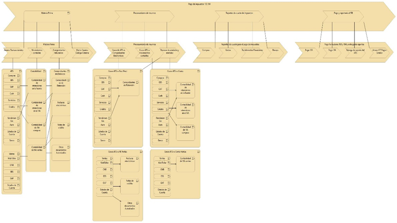

Nombre: Juan Carlos Frutos
Empresa: Banco Pichincha - Gestión Tributaria

Proyecto es Pago de impuestos 103 y 104

El objetivo del proyecto es que permite cargar archivos de Excel de los cuadres de impuestos por cada legado y cuenta contable y tener una matriz que cuadre todos los legados, extraer datos específicos y presentar resultados en un dashboard. La aplicación incluye autenticación con Google y se puede desplegar fácilmente en Vercel.




This is a [Next.js](https://nextjs.org) project bootstrapped with [`create-next-app`](https://nextjs.org/docs/app/api-reference/cli/create-next-app).

## Getting Started

First, run the development server:

```bash
npm run dev
# or
yarn dev
# or
pnpm dev
# or
bun dev
```

Open [http://localhost:3000](http://localhost:3000) with your browser to see the result.

You can start editing the page by modifying `app/page.tsx`. The page auto-updates as you edit the file.

This project uses [`next/font`](https://nextjs.org/docs/app/building-your-application/optimizing/fonts) to automatically optimize and load [Geist](https://vercel.com/font), a new font family for Vercel.

## Learn More

To learn more about Next.js, take a look at the following resources:

- [Next.js Documentation](https://nextjs.org/docs) - learn about Next.js features and API.
- [Learn Next.js](https://nextjs.org/learn) - an interactive Next.js tutorial.

You can check out [the Next.js GitHub repository](https://github.com/vercel/next.js) - your feedback and contributions are welcome!

## Deploy on Vercel

The easiest way to deploy your Next.js app is to use the [Vercel Platform](https://vercel.com/new?utm_medium=default-template&filter=next.js&utm_source=create-next-app&utm_campaign=create-next-app-readme) from the creators of Next.js.

Check out our [Next.js deployment documentation](https://nextjs.org/docs/app/building-your-application/deploying) for more details.


# nextjs-excel-dashboard

Este es un proyecto de Next.js que permite cargar archivos de Excel, extraer datos específicos y presentar resultados en un dashboard. La aplicación incluye autenticación con Google y se puede desplegar fácilmente en Vercel.

## Estructura del Proyecto

- **app/**: Contiene las páginas de la aplicación.
  - **dashboard/**: Página que muestra los resultados de las sumatorias.
  - **login/**: Página para el inicio de sesión utilizando Google.
  - **upload/**: Página para cargar archivos de Excel.
  - **page.tsx**: Página principal de la aplicación.
  - **layout.tsx**: Diseño general de la aplicación.

- **components/**: Componentes reutilizables de la aplicación.
  - **Dashboard.tsx**: Componente que presenta el dashboard.
  - **ExcelUploader.tsx**: Componente para cargar archivos de Excel.
  - **ResultsTable.tsx**: Componente que muestra los resultados en una tabla.
  - **AuthButton.tsx**: Componente para el botón de inicio de sesión.

- **lib/**: Funciones utilitarias.
  - **excelUtils.ts**: Funciones para manejar la lectura y procesamiento de archivos de Excel.
  - **auth.ts**: Lógica de autenticación de usuarios.

- **public/**: Archivos estáticos utilizados en la aplicación.

- **styles/**: Estilos globales de la aplicación.
  - **globals.css**: Estilos comunes aplicados a todos los componentes.

- **types/**: Tipos y interfaces utilizados en la aplicación.
  - **index.ts**: Definiciones de tipos.

- **.env.local**: Variables de entorno locales, incluyendo credenciales de la API de Google.

- **next.config.js**: Configuración de Next.js.

- **package.json**: Configuración de npm, incluyendo dependencias y scripts.

- **tsconfig.json**: Configuración de TypeScript.

## Instalación

Para comenzar, clona el repositorio y navega a la carpeta del proyecto:

```bash
git clone <URL_DEL_REPOSITORIO>
cd nextjs-excel-dashboard
```

Instala las dependencias:

```bash
npm install
# o
yarn install
# o
pnpm install
```

## Ejecución

Para ejecutar el servidor de desarrollo, utiliza:

```bash
npm run dev
# o
yarn dev
# o
pnpm dev
```

Abre [http://localhost:3000](http://localhost:3000) en tu navegador para ver la aplicación en acción.

## Despliegue

Para desplegar la aplicación en Vercel, sigue las instrucciones en la [documentación de Vercel](https://vercel.com/docs).

## Contribuciones

Las contribuciones son bienvenidas. Si deseas contribuir, por favor abre un issue o envía un pull request.

## Licencia

Este proyecto está bajo la Licencia MIT.